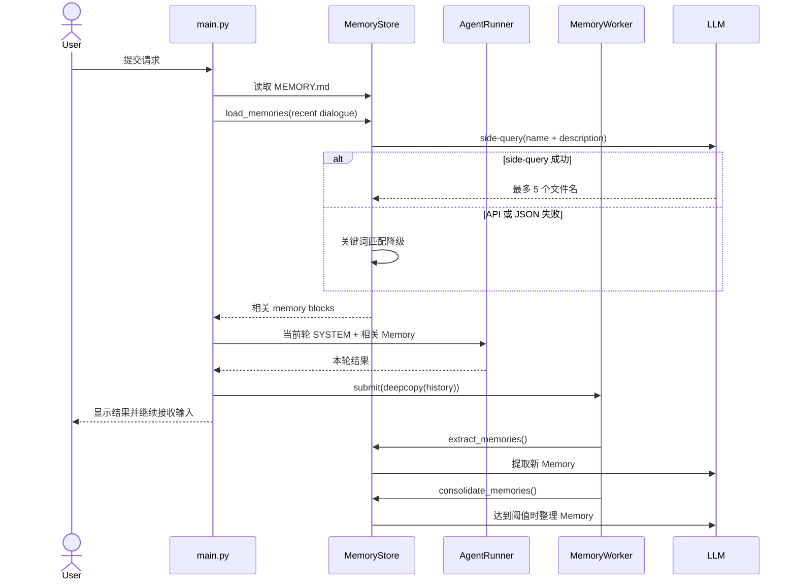

### provider.py
集成模型供应商。
初始化一个provider类，后续可以从中拿取到供应商的`base_url`和所提供的`model` name.

### tools
开发一个新工具基本分 4 步：
- 定义参数模型 `XxxArgs(BaseModel)`
- 定义工具类 `XxxTool(BaseTool[XxxArgs])`
- 在工具类里绑定 `name / description / args_model`
- 在 `ToolSet` 里注册这个工具

## Memory

Memory 用于跨轮次保存用户偏好、反馈、项目事实和外部引用。它由三部分组成：

- `main.py`：在每次用户请求开始时装配 Memory 上下文，并在本轮结束后提交后台维护任务。
- `src/runtime/memory_worker.py`：负责异步调度提取和整理，不阻塞 Agent 主循环。
- `src/infrastructure/memory.py`：负责 Memory 的检索、LLM side-query、提取、合并和文件持久化。

### 存储格式

Memory 保存在当前工作区的 `.swe-agent/memory/`：

```text
.swe-agent/memory/
├── MEMORY.md                  # name + description 索引
├── user-preference-tabs.md    # 单条 Memory
└── project-language.md
```

每条 Memory 是带 YAML frontmatter 的 Markdown 文件：

```markdown
---
name: user-preference-tabs
description: User prefers tabs for indentation
type: user
---

User prefers using tabs, not spaces, for indentation.
```

支持的 `type` 为：

- `user`：用户偏好。
- `feedback`：用户对 Agent 工作方式的指导或纠正。
- `project`：项目事实、约束和约定。
- `reference`：外部资料或引用位置。

`MemoryStore` 由 `main.py` 使用工作区、模型客户端和模型名称构造：

```python
memory_store = MemoryStore(
    workdir,
    client=provider.client,
    model=MODEL,
)
```

工作区路径由应用入口决定，Infrastructure 层不读取 `main.py` 的全局变量。

### 每轮开始：加载 Memory

Memory 通过两条路径进入当前轮上下文。

#### 路径一：索引常驻 SYSTEM

每次收到普通用户请求后，`main.py` 调用 `build_system_prompt()`：

1. 读取 `.swe-agent/memory/MEMORY.md`。
2. 将完整的 Memory 索引追加到 `Persistent memory index` 段落。
3. 将生成的 SYSTEM 传给本轮 `AgentRunner.run()`。

一次 `AgentRunner.run()` 内可能有多次模型和工具迭代，但它们复用同一个 SYSTEM。Memory 提取和整理只在整轮结束后触发，因此同一轮内不重复读取索引或重建 SYSTEM。

#### 路径二：相关 Memory 按需注入

`load_memories(session.history)` 在本轮 Agent 执行前加载相关 Memory：

1. `list_memory_files()` 只收集每条 Memory 的 `filename`、`name` 和 `description` 作为候选目录。
2. 最近对话截取最后 4,000 个字符，与候选目录一起发送给 LLM side-query。
3. side-query 只允许返回候选目录中的精确文件名，最多选择 5 条。
4. `load_memories()` 读取选中文件的正文，并渲染为 `<memory>` 块。
5. `main.py` 将这些块追加到当前轮的 `turn_system_prompt`，不写回 `session.history`。

如果 API 请求失败、响应为空、JSON 无法解析，或者 LLM 没有返回有效文件名，`select_relevant_memories()` 会自动降级为本地关键词匹配。关键词只匹配 Memory 的 `name + description`，名称命中的权重高于描述。

### 每轮结束：异步提取和整理

本轮 `AgentRunner.run()` 返回后，`main.py` 调用：

```python
memory_worker.submit(session.history)
```

`MemoryWorker.submit()` 会先深拷贝消息快照，然后把任务提交到单线程 `ThreadPoolExecutor`。主线程不等待任务结果，立即回到输入提示，因此用户可以继续提交下一条指令。

后台任务固定按以下顺序执行：

1. `extract_memories(messages)` 提取新 Memory。
2. `consolidate_memories()` 在达到阈值时合并重复、冲突或过期 Memory。

单线程队列保证不同轮次的后台任务串行执行，避免多个任务同时修改 Memory 目录。后台维护异常会被限制在 `MemoryWorker` 内，不会中断 Agent 主循环；失败的整理可以在后续轮次重试。



### 新 Memory 提取

`extract_memories()` 将最近对话和现有 Memory 的名称、描述发给 LLM，要求返回 JSON 数组：

```json
[
  {
    "name": "user-preference-tabs",
    "type": "user",
    "description": "User prefers tabs for indentation",
    "body": "Always use tabs when writing or editing files."
  }
]
```

写入前会校验必填字段和 Memory 类型，并跳过已有的同名 Memory。有效记录通过 `MemoryStore.write()` 写入独立 Markdown 文件，随后重建 `MEMORY.md`。

### Memory 整理

当 Memory 文件数量达到 `CONSOLIDATE_THRESHOLD`（当前为 10）时，`consolidate_memories()` 调用 LLM 检查重复、冲突和过期记录。LLM 返回：

```json
{
  "memories": [
    {
      "name": "coding-style",
      "type": "user",
      "description": "Preferred coding style",
      "body": "Use tabs consistently."
    }
  ],
  "remove": [
    "style-tabs.md",
    "style-spaces.md"
  ]
}
```

整理过程先写入合并后的 Memory，再删除 `remove` 中明确列出的源文件。删除范围被限制为当前 Memory 目录中已存在的文件，并且不会删除刚写入的目标文件。完成后重新生成 `MEMORY.md`。

### 一致性和失败边界

- Memory 文件和 `MEMORY.md` 使用同目录临时文件加原子替换写入，主线程不会读到半写入内容。
- side-query 失败只影响相关 Memory 的精确度，会降级为关键词匹配。
- 后台提取或整理失败不会影响当前回答或下一轮用户输入。
- `MemoryWorker` 只有一个工作线程，保证提取、整理和文件删除按轮次顺序执行。
- `/clear` 等 slash command 不会触发 Memory 提取；只有执行过 `AgentRunner.run()` 的普通用户请求会在结束时提交后台任务。
